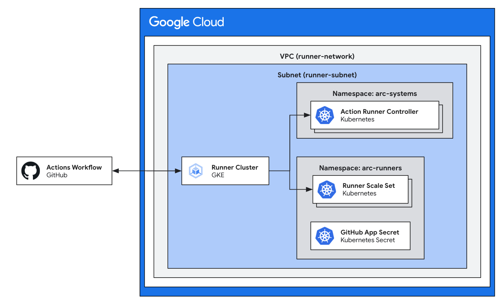

# Self Hosted Runners on GKE

This module handles the opinionated creation of infrastructure necessary to deploy GitHub Actions Runners on GKE. This module follows the guide provided by GitHub for [Quickstart for Actions Runner Controller](https://docs.github.com/en/actions/hosting-your-own-runners/managing-self-hosted-runners-with-actions-runner-controller/quickstart-for-actions-runner-controller).



This includes:

- Enabling necessary APIs
- VPC
- GKE Cluster
- Kubernetes Secret
- Installation via Helm Chart

## Usage
See below for example usage of this module:
```tf
module "runner-gke" {
  source  = "terraform-google-modules/github-actions-runners/google//modules/gh-runner-gke"
  version = "~> 5.1"

  project_id             = "PROJECT_ID"
  create_network         = true
  cluster_suffix         = "k8s"
  gh_app_id              = "123456"
  gh_app_installation_id = "12345678"
  gh_app_private_key     = "sample"
  gh_config_url          = "https://github.com/ORGANIZATION"
}
```

### Authenticating to GitHub

It's recommended to authenticate to GitHub via a GitHub App. Follow the instructions at [Authenticating ARC with a GitHub App](https://docs.github.com/en/actions/hosting-your-own-runners/managing-self-hosted-runners-with-actions-runner-controller/authenticating-to-the-github-api#authenticating-arc-with-a-github-app) to retrieve the necessary prerequisites:

- GitHub App ID
- GitHub App Installation ID
- GitHub App Private Key

Install the app in the organization or account for which the runners should be available.

Substitute these values gathered from creating the GitHub App installation into the variables in the module.

## Requirements

Before this module can be used on a project, you must ensure that the following pre-requisites are fulfilled:

1. Required APIs are activated

    ```
    "cloudresourcemanager.googleapis.com",
    "storage-api.googleapis.com",
    "iam.googleapis.com",
    "container.googleapis.com",
    "serviceusage.googleapis.com"
    ```

## Examples

### [Simple Self Hosted Runners on GKE](../../examples/gh-runner-gke-simple/README.md)

This example shows how to deploy a simple GKE Self Hosted Runner.

Below are some examples:

### [Self Hosted runners on GKE that support Docker workflows](../../examples/gh-runner-gke-dind/README.md)

This example shows how to deploy Self Hosted Runners on GKE that supports Docker Workflows.

### [Self Hosted runners on GKE that support Docker Workflows in rootless configuration](examples/gh-runner-gke-dind-rootless/)

This example shows how to deploy Self Hosted Runners on GKE that supports Docker Workflows in a rootless configuration.

<!-- BEGINNING OF PRE-COMMIT-TERRAFORM DOCS HOOK -->
## Inputs

| Name | Description | Type | Default | Required |
|------|-------------|------|---------|:--------:|
| arc\_container\_mode | value of containerMode.type in ARC runner scale set helm chart. If set, value can be `dind` or `kubernetes` | `string` | `""` | no |
| arc\_controller\_values | List of values in raw yaml format to pass to helm for ARC runners scale set controller chart | `list(string)` | `[]` | no |
| arc\_controller\_version | Version tag for the ARC image. See [https://github.com/actions/actions-runner-controller/pkgs/container/actions-runner-controller-charts%2Fgha-runner-scale-set-controller](https://github.com/actions/actions-runner-controller/pkgs/container/actions-runner-controller-charts%2Fgha-runner-scale-set-controller) for releases. | `string` | `"0.9.3"` | no |
| arc\_runners\_namespace | Namespace created for the ARC runner pods. | `string` | `"arc-runners"` | no |
| arc\_runners\_values | List of values in raw yaml format to pass to helm for ARC runners scale set chart | `list(string)` | `[]` | no |
| arc\_runners\_version | Version tag for the ARC image. See [https://github.com/actions/actions-runner-controller/pkgs/container/actions-runner-controller-charts%2Fgha-runner-scale-set](https://github.com/actions/actions-runner-controller/pkgs/container/actions-runner-controller-charts%2Fgha-runner-scale-set) for releases. | `string` | `"0.9.3"` | no |
| arc\_systems\_namespace | Namespace created for the ARC operator pods. | `string` | `"arc-systems"` | no |
| cluster\_suffix | Name of the GitHub organization associated with this runner cluster. | `string` | `"arc"` | no |
| create\_network | When set to true, VPC will be auto created | `bool` | `true` | no |
| enable\_private\_nodes | Whether nodes have internal IP addresses only. | `bool` | `false` | no |
| gh\_app\_id | After creating the GitHub App, on the GitHub App's page, note the value for "App ID". | `string` | n/a | yes |
| gh\_app\_installation\_id | You can find the app installation ID on the app installation page, which has the following URL format: `https://github.com/organizations/ORGANIZATION/settings/installations/INSTALLATION_ID` | `string` | n/a | yes |
| gh\_app\_pre\_defined\_secret\_name | Name for the k8s secret required to configure gh runners on GKE via GitHub App authentication | `string` | `"gh-app-pre-defined-secret"` | no |
| gh\_app\_private\_key | Under "Private keys", click Generate a private key, and save the .pem file. Use the contents of this file for this variable. | `string` | n/a | yes |
| gh\_config\_url | URL of GitHub App config. If installed in an organization, this is in the format "https://github.com/ORGANIZATION" | `string` | n/a | yes |
| ip\_range\_pods\_cidr | The secondary ip range cidr to use for pods | `string` | `"192.168.0.0/18"` | no |
| ip\_range\_pods\_name | The secondary ip range to use for pods | `string` | `"ip-range-pods"` | no |
| ip\_range\_services\_cider | The secondary ip range cidr to use for services | `string` | `"192.168.64.0/18"` | no |
| ip\_range\_services\_name | The secondary ip range to use for services | `string` | `"ip-range-scv"` | no |
| machine\_type | Machine type for runner node pool | `string` | `"n1-standard-4"` | no |
| max\_node\_count | Maximum number of nodes in the runner node pool | `number` | `4` | no |
| min\_node\_count | Minimum number of nodes in the runner node pool | `number` | `2` | no |
| network\_name | Name for the VPC network | `string` | `"runner-network"` | no |
| project\_id | The project id to deploy Github Runner cluster | `string` | n/a | yes |
| region | The GCP region to deploy instances into | `string` | `"us-east4"` | no |
| service\_account | Optional Service Account for the nodes | `string` | `""` | no |
| spot | A boolean that represents whether the underlying node VMs are spot | `bool` | `false` | no |
| subnet\_ip | IP range for the subnet | `string` | `"10.0.0.0/17"` | no |
| subnet\_name | Name for the subnet | `string` | `"runner-subnet"` | no |
| subnetwork\_project | The ID of the project in which the subnetwork belongs. If it is not provided, the project\_id is used. | `string` | `""` | no |
| zones | The GCP zone to deploy gke into | `list(string)` | <pre>[<br>  "us-east4-a"<br>]</pre> | no |

## Outputs

| Name | Description |
|------|-------------|
| ca\_certificate | The cluster ca certificate (base64 encoded) |
| client\_token | The bearer token for auth |
| cluster\_name | Cluster name |
| kubernetes\_endpoint | The cluster endpoint |
| location | Cluster location |
| network\_name | Name of VPC |
| service\_account | The default service account used for running nodes. |
| subnet\_name | Name of VPC |

<!-- END OF PRE-COMMIT-TERRAFORM DOCS HOOK -->
